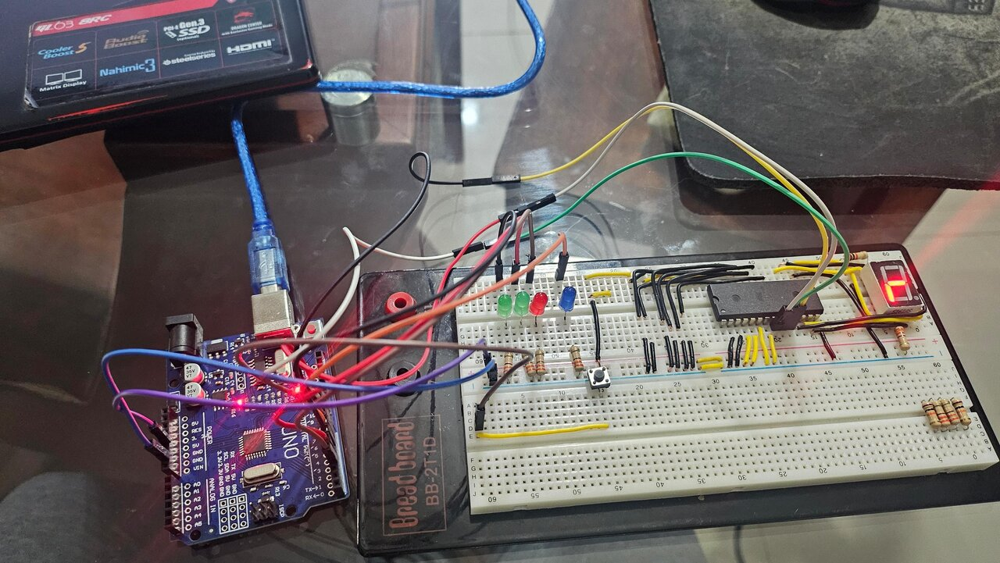
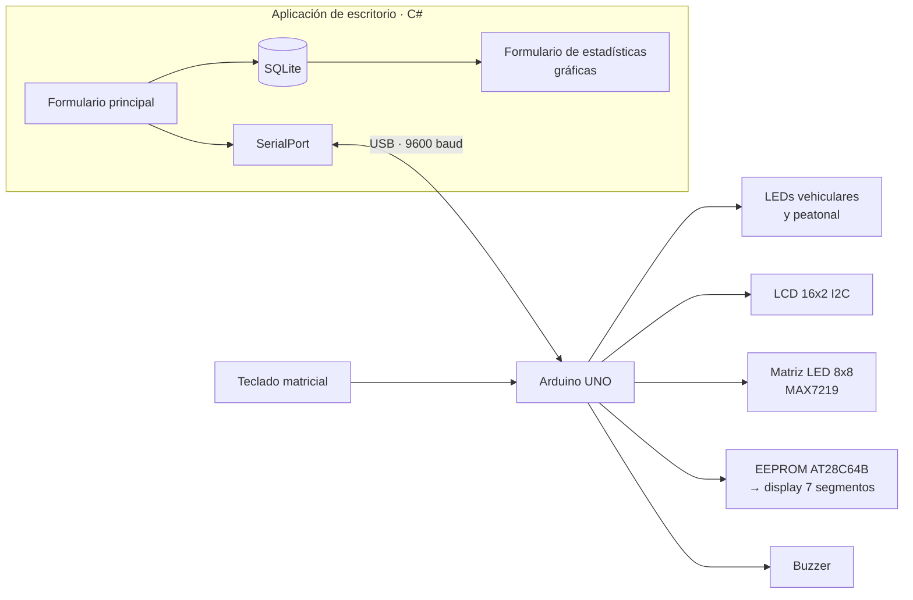
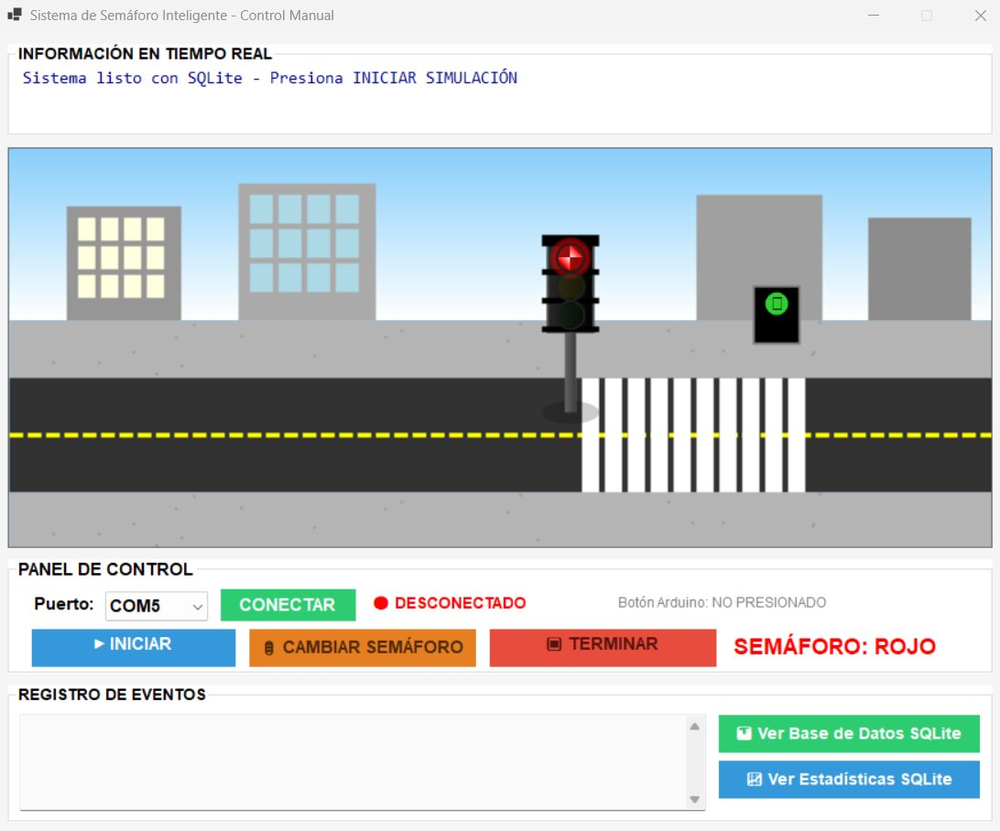
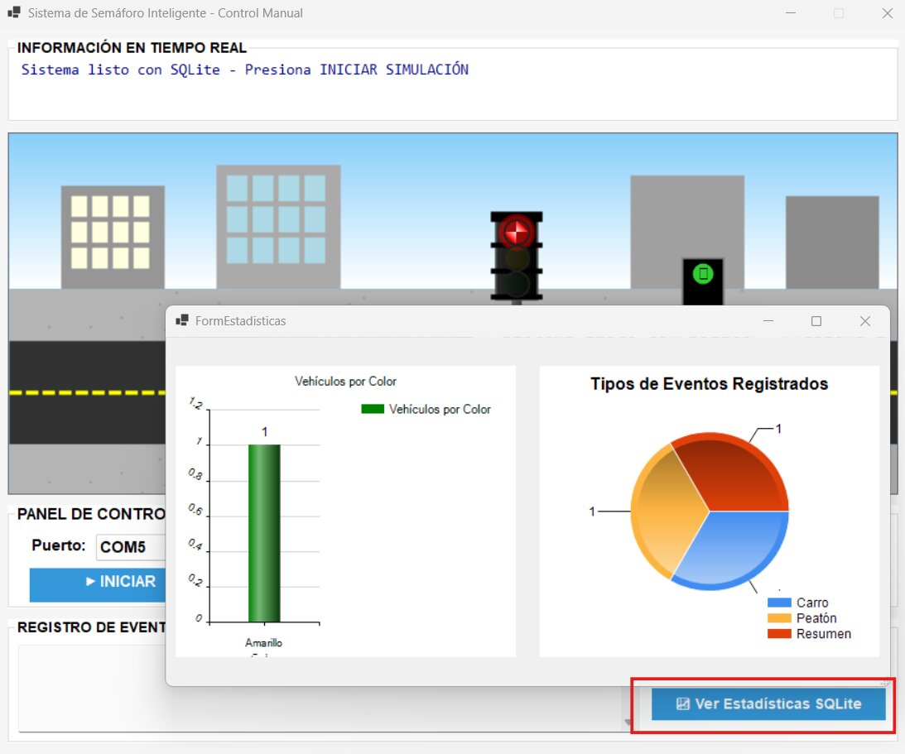
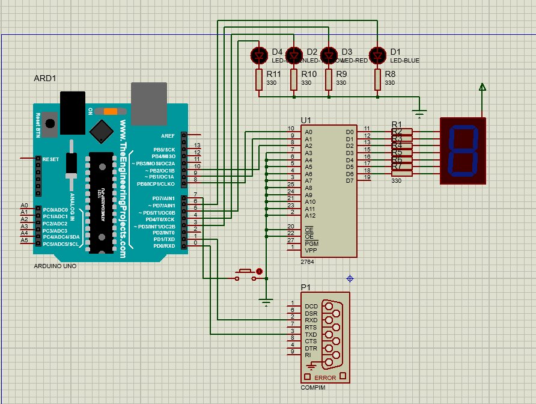
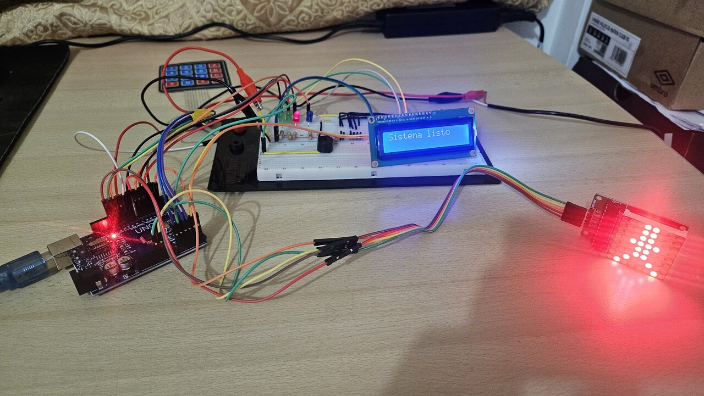
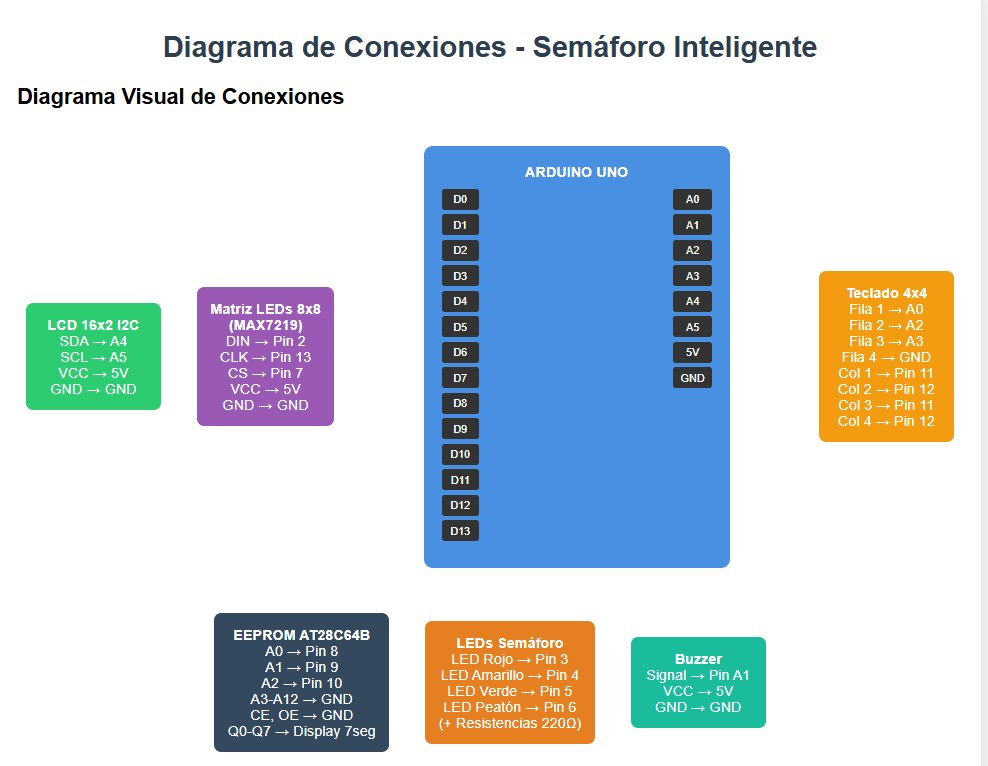

<div align="center">

# Semáforo Inteligente

### Sistema embebido con Arduino controlado y monitoreado desde una aplicación de escritorio en C#, con registro en SQLite y estadísticas en tiempo real

[](https://www.arduino.cc/)
[](https://docs.arduino.cc/language-reference/)
[](https://learn.microsoft.com/dotnet/desktop/winforms/)
[](https://www.sqlite.org/)
[](https://www.labcenter.com/)



</div>

---

## Descripción

Semáforo vehicular y peatonal construido sobre **Arduino UNO** que integra hardware real (LEDs, LCD, teclado, buzzer, matriz de LEDs y una memoria **EEPROM AT28C64B** programada a mano para el display de 7 segmentos) con una **aplicación de escritorio en C#** que lo controla por **puerto serial**, guarda cada evento en **SQLite** y genera **gráficas estadísticas** en tiempo real.

El sistema se validó dos veces: en **hardware físico** sobre protoboard y en **simulación completa en Proteus 8** con comunicación serial virtual (COMPIM).

## Características

**Firmware (Arduino)**
- Ciclo de semáforo vehicular con fase peatonal y temporización configurable.
- **LCD 16x2 por I2C** con el estado actual y cuenta regresiva.
- **Matriz de LEDs 8x8 (MAX7219)** con animaciones del peatón.
- **Display de 7 segmentos** alimentado desde una **EEPROM AT28C64B** codificada para mostrar letras.
- **Teclado matricial** para control manual y **buzzer** con melodías por color.
- Protocolo de comandos por **Serial** (cambio de color, apagado, consulta de estado).

**Aplicación de escritorio (C# · WinForms)**
- Conexión al Arduino seleccionando el puerto COM.
- Control remoto del semáforo y visualización del estado en vivo.
- Registro persistente de cada cambio en **SQLite**.
- Ventana de **estadísticas** con gráficas generadas desde la base de datos.

## Arquitectura



## Galería

<table>
  <tr>
    <td></td>
    <td></td>
  </tr>
  <tr>
    <td align="center"><sub>Aplicación de control en C#</sub></td>
    <td align="center"><sub>Estadísticas generadas desde SQLite</sub></td>
  </tr>
  <tr>
    <td></td>
    <td></td>
  </tr>
  <tr>
    <td align="center"><sub>Simulación en Proteus 8 con COMPIM</sub></td>
    <td align="center"><sub>Montaje con todos los componentes</sub></td>
  </tr>
</table>

<div align="center">
  
  <br><sub>Diagrama completo de conexiones</sub>
</div>

## Hardware

| Componente | Uso |
|---|---|
| Arduino UNO | Controlador principal |
| LEDs rojo, amarillo, verde y peatonal | Señales del semáforo |
| LCD 16x2 con módulo I2C | Estado y cuenta regresiva |
| Matriz LED 8x8 + MAX7219 | Animación del peatón |
| EEPROM AT28C64B + display 7 segmentos | Visualización de letras codificadas |
| Teclado matricial | Control manual |
| Buzzer | Señales sonoras por fase |

## Estructura

```
├── arduino/semaforoProject/   Firmware (.ino) documentado con tabla de pines
├── desktop-app/               Solución Visual Studio (WinForms, .NET 8)
├── docs/                      Informe técnico completo (PDF)
└── media/                     Fotografías y capturas
```

## Cómo ejecutarlo

1. **Firmware:** abrir `arduino/semaforoProject/semaforoProject.ino` en Arduino IDE, instalar las librerías `Keypad`, `LedControl` y `LiquidCrystal_I2C`, y cargar en el Arduino UNO.
2. **Aplicación:** abrir `desktop-app/SEMAFORO_AVANZADO.sln` en Visual Studio 2022, restaurar paquetes NuGet y ejecutar.
3. Seleccionar el puerto COM del Arduino y conectar.

 El diseño, la codificación de la EEPROM y las pruebas están en el [informe técnico](docs/Informe_Semaforo_Inteligente.pdf).

## Equipo

| Integrante |
|---|
| **Marco Adrian Padilla Triviño** ([@Adrizzx](https://github.com/Adrizzx)) |
| Lenin Antonio Barrionuevo Rodríguez |
| Angelo Raphael Galarza Manosalvas |

<div align="center">
<sub>Computación Digital · Universidad de las Fuerzas Armadas ESPE · 2025</sub>
</div>
